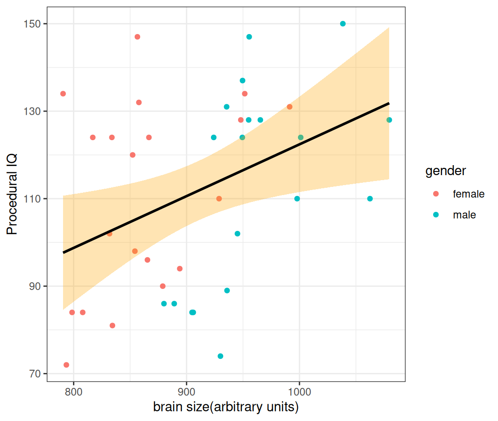
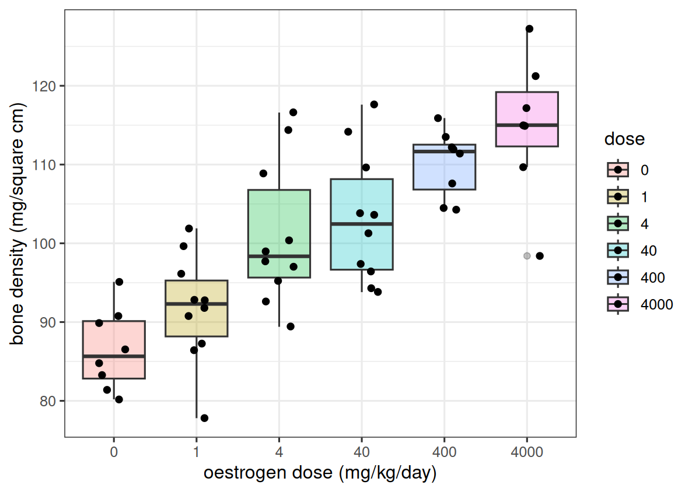
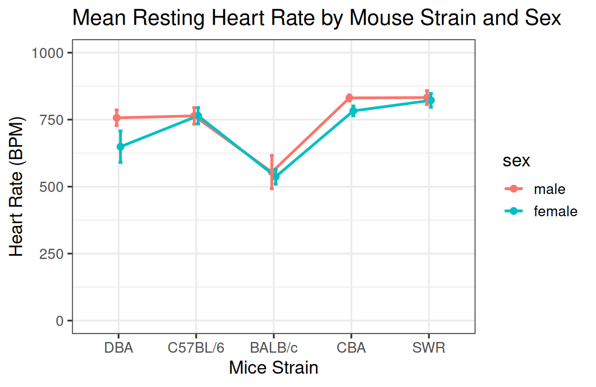
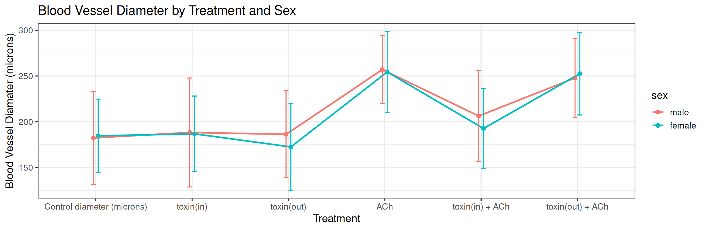

# Statistics with R

> Script for sections 1-2.

[View the R script](IQ_analysis.R)

## Section 1: Simple Linear Regression

I examined the relationship between brain size and PIQ scores in 39 observations., using R to fit a regression and examine how well it describes the data.

```r
PIQ_model = lm(PIQ ~ brain_size, data = IQ_dataset, na.action = na.exclude)
summary(PIQ_model)
```

**Tools:** R, tidyverse, easystats, readxl, and qqplotr.




- **Positive association:** Larger brain size was associated with higher PIQ scores (slope = 0.118, 95% CI [0.024, 0.212], p = .015).
- **Modest explanatory power:** The model accounted for approximately 15% of the variation in PIQ (R² = .150; adjusted R² = .127).
- **Bootstrap support:** The bootstrap confidence interval for the slope also excluded zero [0.029, 0.211] supporting positive association.
- **Residual normality:** The Shapiro–Wilk test did not detect a significant departure from normality (W = .962, p = .204).

The fitted equation was:

**Predicted PIQ = 4.061 + 0.118 × brain size**

## Section 2: Multiple Linear Regression

I extend the analysis beyond brain size alone, examining a model that includes brain size and height as predictors of PIQ.

- **Improved fit:** Adding height increased R² from .150 to .285. The improvement was statistically significant (p = .014), while the third model, gender, offered no significant further improvement (p = .554).
- **Preferred model:** The brain size + height model had the lowest AIC and BIC, with an adjusted R² of .245.
- **Predictor associations:** Holding the other predictor constant, brain size was positively associated with PIQ (standardised β = .659, p < .001), while height was negatively associated (β = −.458, p = .013).
- **Diagnostics:** The Shapiro–Wilk test did not detect a significant departure from residual normality (p = .458). Both predictors had VIF = 1.55, suggesting limited multicollinearity.
- **Influence:** Case 14 was flagged by the chosen influence screening rule and warrants further examination.
- **Sensitivity check:** Rank based regression also found a positive brain size association and a negative height association, both statistically significant.

The two-predictor model accounted for approximately **28.5% of the observed variation in PIQ**. The single regression model from section 1 only accounted for 15%.

## Sections 3: ANOVA and Planned Contrasts

[View the R script](Oestrogen.R)

The data set contained data on bone mineral density (BMD, measured in mg/cm2 ) from mice that were randomly allocated into six treatment groups that received different doses of oestrogen (or vehicle). Following one month of treatment, the mice were killed and the BMD measured for their left proximal tibia.

### <ins>**In this section, I analysed the data to answer the following questions:**</ins>

1.) Does oestrogen treatment affect mean BMD in the left proximal tibia?
> Yes. Mean BMD differed significantly across oestrogen treatment groups, F(5, 47) = 16.53, p < .001, ω² = .59.

2.) Does mean BMD in mice treated with doses of oestrogen greater than 300 mg/kg/day differ from BMD in mice treated with doses of between 3 and 300 mg/kg/day?
> Yes. The high dose groups (400 and 4000 mg/kg/day) had significantly higher mean BMD than the middle dose groups (4 and 40 mg/kg/day), t(47) = 4.05, p < .001.

3.) Is there a trend for bone density to change with oestrogen dose?
> Yes. BMD showed a significant positive linear trend across the ordered dose groups, t(47) = 8.94, p < .001. This describes the trend across group positions, not a linear increase per mg/kg/day.




## Sections 4: Factorial ANOVA

[View the R script](FactorialANOVA.R)

### <ins>**In this section, I analysed the data to consider whether resting heart rate differs between males and females and whether these sex differences are affected by mouse strain.**</ins>

Resting heart rate differed between males and females, and the size of this difference depended on mouse strain. The two-way ANOVA showed a significant effect of sex, F(1, 68) = 16.36, p < .001, and a significant sex × strain interaction, F(4, 68) = 4.73, p = .002. This interaction indicates that the sex difference was not consistent across strains.

The reported Sidak-adjusted comparisons showed that:
- DBA males had higher heart rates than females, by approximately 108 bpm (756.88 versus 649.00 bpm; p < .001).
- CBA males had higher heart rates than females, by approximately 48 bpm (831.12 versus 782.75 bpm; p = .032).
- No statistically significant sex differences were detected in C57BL/6, BALB/c or SWR mice (all p ≥ .637).

The robust ANOVA also found significant effects of sex (p = .00015) and the sex × strain interaction (p = .00429), supporting the overall conclusion. Therefore, the evidence supports a sex difference that varies by strain, rather than a uniform difference across all mice. These analyses establish the statistical pattern but do not explain its biological cause.



## Sections 5: Repeated Measures ANOVA

[View the R script](RepeatedANOVA.R)

### <ins>**In this section, I analysed the data to consider whether sex affects the responses to acetylcholine and toxin administration, and whether the results support an internal or external site involved in acetylcholine-induced relaxation of the artery.**</ins>

Blood vessel diameter differed between treatments, but there was no evidence that these responses depended on sex. A mixed two-way ANOVA on log-transformed diameter showed a significant effect of treatment, F(2.24, 29.11) = 31.69, p < .001. Neither the main effect of sex, F(1, 13) = 0.04, p = .844, nor the sex × treatment interaction, F(2.24, 29.11) = 0.68, p = .528, was significant. Greenhouse–Geisser corrections were applied because Mauchly’s test indicated a violation of sphericity (p < .001).

The Bonferroni-adjusted comparisons showed that:

- Acetylcholine (ACh) increased blood vessel diameter compared with control (p < .001), consistent with a relaxant effect.
- Toxin administered inside the artery together with ACh produced a lower diameter than ACh alone (p < .001), indicating attenuation of the ACh response.
- Toxin administered outside the artery together with ACh produced no statistically significant difference from ACh alone (p = .656), and diameter remained higher than control (p < .001).
- Diameter was significantly higher with toxin(out) + ACh than with toxin(in) + ACh (p < .001).

These results provide no evidence that the pattern of responses to ACh and toxin administration differs between males and females, although they do not prove identical responses. The reduction in the ACh response following internal toxin administration supports an internal site involved in relaxation, provided the toxin acts locally on the relevant mechanism and remains confined to the side where it is applied. Confirmation of the toxin’s mechanism is needed before making a firm conclusion about the site of action.





**Section 6-7 coming as the class progresses.** Topics and code will be added here—check back to follow the project.
