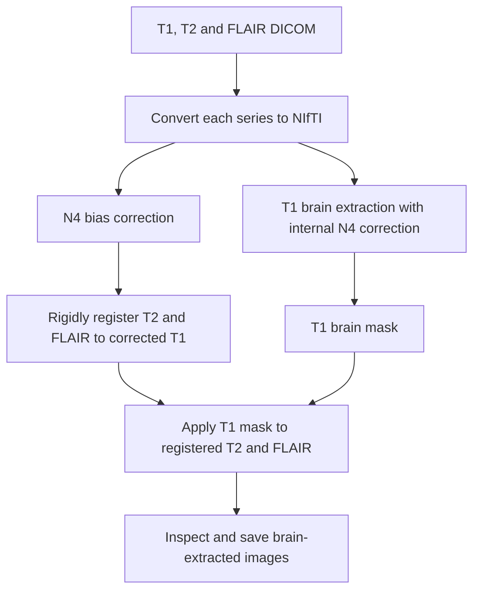
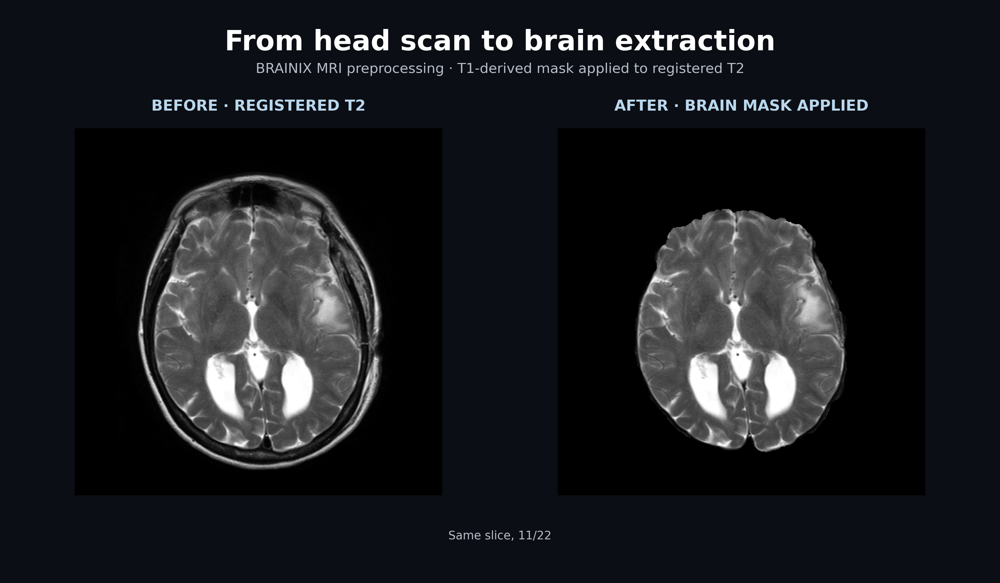

# BRAINIX MRI Preprocessing in R

**DICOM conversion · Bias correction · Brain extraction · Multimodal registration**

## Short Description

This independent project brings together skills I learned in *Neurohacking for R* to build a preprocessing workflow for T1, T2, and FLAIR MRI scans.

I use R to load and inspect the images, convert them to NIfTI, and run ANTs tools for bias-field correction, brain extraction, and registration. The final steps align T2 and FLAIR to T1 and apply the T1 brain mask to both registered images.

[**View the full R script →**](brainix_preprocessing%20copy.R)

> The script uses local data, template files, and an ANTs installation. Its paths must be configured before running.

---

## At a Glance

| Component | What it does |
|---|---|
| **R + `oro.dicom`** | Read the DICOM series |
| **`oro.nifti`** | Convert, inspect, read, and save NIfTI images |
| **ANTs N4** | Correct smooth intensity variation from the bias field |
| **ANTs brain extraction** | Estimate a T1 brain mask using a template and mask prior |
| **ANTs rigid registration** | Align T2 and FLAIR to the T1 reference |
| **Visual checks** | Inspect slices, mask contours, and registered images |

## The Workflow

---

---
## What I Practised

- Working with DICOM and NIfTI image formats in R
- Connecting an R workflow to external ANTs commands
- Distinguishing bias correction, brain extraction, and registration
- Checking command exit codes and expected output files
- Inspecting preprocessing results rather than relying only on successful execution
